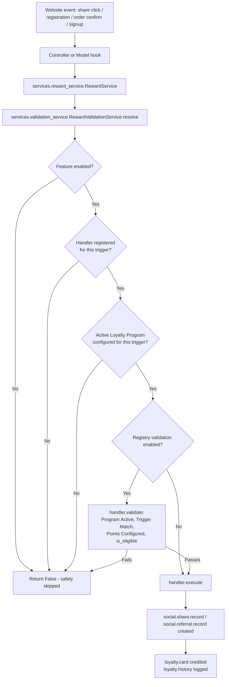
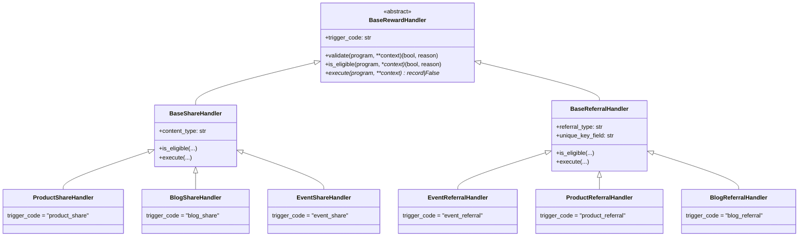
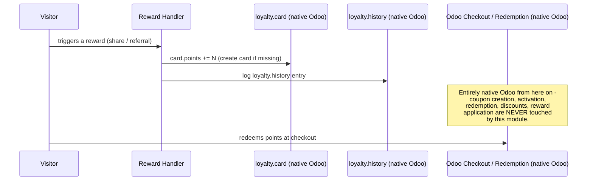

# Architecture

## Goals

1. Reward execution must never depend on hardcoded if/elif chains.
2. An unsupported or unconfigured Reward Trigger must **always** be
   safely ignored — never crash, never guess, never award points.
3. Adding a new reward type must require **creating and registering a
   handler only** — no changes to any existing model, view, or service.
4. This module never replaces Odoo's native Loyalty Engine — it is only
   ever responsible for *earning* points onto a `loyalty.card`.

## High-level flow



## Registry / Handler (Strategy) Pattern



`handlers/registry.py` holds a single module-level dict,
`HANDLER_REGISTRY: dict[str, type[BaseRewardHandler]]`, populated at
import time by the `@register_handler` decorator on each concrete
handler class. There is exactly one lookup function,
`get_handler(trigger_code, env)`:

```python
def get_handler(trigger_code, env):
    if not trigger_code or trigger_code == "none":
        return None
    handler_cls = HANDLER_REGISTRY.get(trigger_code)
    if not handler_cls:
        _logger.warning("No reward handler registered for trigger '%s' ...", trigger_code)
        return None
    return handler_cls(env)
```

This is the literal implementation of the pattern requested in the
spec: no big if/elif block anywhere decides which handler runs for
which trigger — the dict lookup *is* the dispatch.

## Validation Layer

`services/validation_service.py::RewardValidationService.resolve()` is
the single choke point every reward passes through, in this exact
order:

1. **Feature enabled** — the master Settings switch for Share or
   Referral rewards.
2. **Registered Handler Exists** — `handlers.registry.get_handler()`.
3. **Reward Trigger Exists / Program configured** — an active
   `loyalty.program` with a matching `reward_trigger` (or the optional
   global fallback program, if an admin explicitly enabled it).
4. **Program Active**, **Reward Configured** (points > 0) — checked
   inside `BaseRewardHandler.validate()`.
5. **Customer Eligible**, **Duplicate Prevention**, **Self-Referral
   Prevention** — trigger-specific, in each handler's `is_eligible()`.

If any step fails, `resolve()` returns a `reason` string and the caller
(`RewardService`) returns `False` — the surrounding Odoo flow (event
registration, sale confirmation, user signup, share click) is always
left completely unaffected either way.

## Service Layer

`services/reward_service.py::RewardService` exposes exactly two public
methods:

* `grant_share_reward(env, partner, url, content_name, source_id)`
* `register_referral(env, referral_type, referrer_partner, referred_partner, **extra)`

Every model (`event_registration.py`, `sale_order.py`, `res_users.py`)
and controller (`controllers/share.py`) calls into these — never into
`handlers/` or `social.share.record` / `social.referral.record`
directly. This is the Dependency Inversion in practice: callers depend
on the service's stable public interface, not on which handler ends up
running.

## Relationship to Odoo's native Loyalty Engine



This module **only ever calls `card.write({'points': ...})` and creates
`loyalty.history` rows** (via
`models/loyalty_reward_mixin.py::_credit_loyalty_points()` and the
equivalent logic in the handlers). It never creates `loyalty.reward`,
`loyalty.rule`, or coupon-related records, and never touches the
redemption flow.

## Configuration architecture

Version 2.0's first release placed configuration inside Sales ->
Configuration -> Settings, inheriting `sale.res_config_settings_view_form`
via XPath. That approach caused installation/compatibility issues on
some Odoo 19 builds, so it has been replaced entirely.

Configuration now lives on its own dedicated, non-Settings screen:

```
Sales
  -> Configuration
       -> Social Media & Loyalty         (new menu, before Activities)
            -> Social Sharing, Referral & Loyalty Points
```

This opens a single record of `social.loyalty.config`
(`models/social_loyalty_config.py`) - a normal model, not
`res.config.settings`, with no `config_parameter` field attribute and
no Settings-screen XPath at all. It is enforced as a true singleton:
exactly one row is ever created (`data/social_loyalty_config_data.xml`),
the form disables Create/Delete, and `create()`/`unlink()` are
overridden as a server-side backstop.

Every field on that model is a non-stored `compute` + `inverse` pair
that reads/writes the exact same `ir.config_parameter` keys the reward
engine already read directly before this change
(`services/validation_service.py`, `models/event_registration.py`,
`models/res_users.py`, `models/sale_order.py`, `models/ir_http.py`).
None of those files needed to change how they read configuration - only
where an administrator goes to *set* it changed.

Access is restricted to the existing, native `sales_team.group_sale_manager`
group - no custom security group is defined by this module.

## Backward compatibility

* `models/share_record.py::grant_share_reward()` is kept as a thin,
  backward-compatible wrapper around `RewardService.grant_share_reward()`
  — any code still calling it directly keeps working unchanged.
* `models/referral_record.py` (the model itself, its auto-claim
  `create()` override, `action_claim()`, and the Share-Reward reversal
  logic) is **untouched** — the new architecture only changed *how* a
  `social.referral.record` gets created, never what happens once it
  exists.
* `migrations/19.0.2.0.0/` converts existing `loyalty.program` records
  from the old boolean flags to the new `reward_trigger` field
  automatically on upgrade — see that folder's docstrings for the exact
  mapping and one manual follow-up worth reviewing (programs that had
  "Use for Social Share Rewards" checked, which used to cover both
  Product and Blog shares from a single program).
